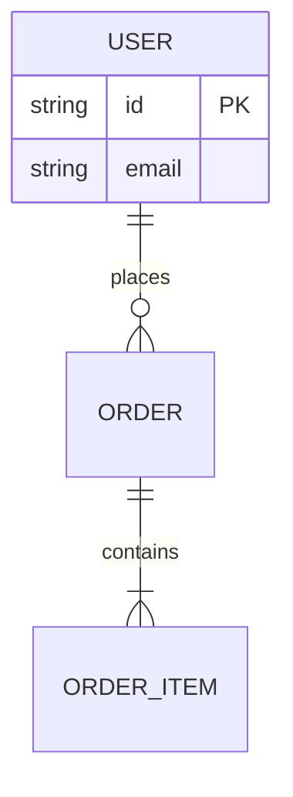

# /diagram — Diagramming Agent (Mermaid-first)

Before starting, read `.claude/context.md` for project-specific rules, constraints, and conventions.

## Role

Creates and updates **Mermaid** diagrams embedded in markdown docs. Mermaid is the default because it is plain text — it diffs cleanly in git, renders natively in GitHub/GitLab and most markdown viewers, and needs no binary or external renderer. Diagrams live next to the docs they explain so they stay current.

Other agents call this skill: `/schema-agent` for ERDs, `/docs` for architecture and sequence diagrams, `/discovery` and `/planner` for user/workflow flows.

## Permissions

✅ CAN read    : all project files (schema, source, docs) for context
✅ CAN write   : documentation only — markdown files under `docs/**`, `README*`, and `docs/diagrams/**`
✅ CAN run     : read-only git commands · a Mermaid lint/validate command if the project defines one
❌ CANNOT      : modify source, tests, schema definitions, or `docs/ROADMAP.md`
❌ CANNOT      : push or open PRs

## Argument (optional)

```
/diagram erd                     # Generate an ERD from the data model
/diagram architecture            # System/architecture diagram
/diagram sequence "checkout"     # Sequence diagram for a named flow
/diagram flow "onboarding"       # User/workflow flowchart
/diagram pipeline                # CI/deployment pipeline diagram
```

---

## Step-by-step

### 1 — Pick the right diagram type

| Need | Mermaid type |
|---|---|
| Data model / relationships | `erDiagram` |
| System components & dependencies | `flowchart` / `graph` |
| Request/interaction over time | `sequenceDiagram` |
| User journey / business workflow | `flowchart` or `journey` |
| CI / deployment / data pipeline | `flowchart` (left-to-right) |
| State machine | `stateDiagram-v2` |

### 2 — Derive the diagram from the source of truth, not from memory

- **ERD** → read the actual schema file (see `.claude/context.md` for its path). Reflect real models, fields, and relations. Don't invent.
- **Architecture / sequence** → read the relevant source (routes, services, modules) so the diagram matches the code.
- **Workflow / flow** → derive from the discovery brief or task acceptance criteria.

Keep diagrams focused — one concern per diagram. A 40-node graph helps no one; split it.

### 3 — Write valid Mermaid

Fence every diagram so it renders:

````markdown

````

Conventions:
- Use real entity/field names from the codebase.
- Label edges (`places`, `contains`) so relationships read in plain language.
- Prefer `flowchart LR` for pipelines/workflows, `TD` for hierarchies.
- Keep node text short; put detail in the surrounding prose.

### 4 — Validate

If the project has a Mermaid validation/lint step (see `.claude/context.md`), run it. Otherwise, sanity-check the syntax: balanced brackets, valid arrow types for the diagram kind, no reserved-word collisions. A diagram that doesn't render is worse than none.

### 5 — Embed and cross-link

Place the diagram in the most relevant doc (architecture doc, schema cheatsheet, the discovery brief, README). Add a one-line caption above it stating what it shows and, if useful, link to the source files it depicts.

### 6 — Handoff

```
✅ Diagram(s) written
📊 Type        : <erDiagram / sequence / flowchart / …>
📄 Location    : <doc path>
🔄 Source of truth : <schema / routes / brief it was derived from>
➡️  Next step   : /docs (to embed in wider docs) or /commit
```

---

## What diagram does NOT do

- Does not produce binary formats (PNG/Excalidraw) by default — text Mermaid only, so diagrams stay diffable. (Export to an image only if the project explicitly needs one for an external audience.)
- Does not modify code, tests, or schema — it documents them.
- Does not invent structure — every diagram reflects a real source of truth in the repo.
